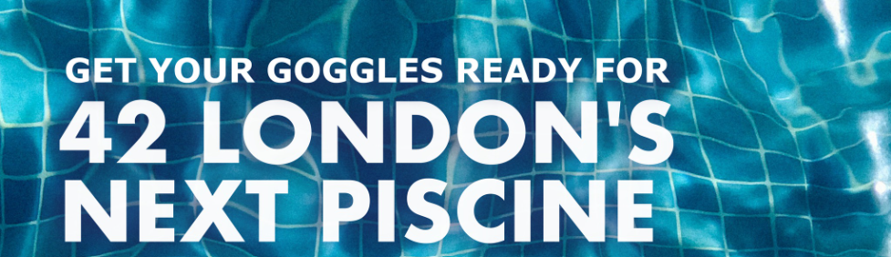
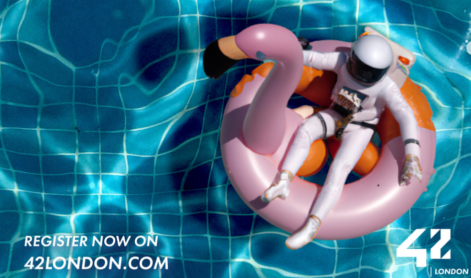

# Discovery_piscine

<!-- PROJECT LOGO -->
 

  
 

<!-- TABLE OF CONTENTS -->
## Table of Contents

- [About the project](#about-discovery-piscine)
  * [Parts of the project](#project)
  * [Languages](#languages)
  * [Technologies](#technologies)
- [License](#license)

 

<!-- ABOUT THE PROJECT -->
## About Discovery Piscine

Projects carried out during the discovery piscine of **[42London](https://42london.com)** web development.
The 42 network discovery pool is a week program that offers the opportunity to learn about web development with HTML, CSS and JavaScript. It is a way to discover the methodology and philosophy of 42, an innovative and free programming school.

To participate in the discovery pool, you need a commitment to attend daily and complete at least 40 hours a week, and physical presence on campus. The discovery pool is an intense and challenging experience that can open doors to a career in the technology sector.

 

### Projects

* [x] **Cellule0:** Shell
* [x] **Cellule1:** HTML and CSS
* [x] **Cellule2:** HTML, CSS and (JavaScript)
* [x] **Cellule3:** HTML, CSS and JavaScript
* [x] **Cellule4:** Rush, create your fisrt portfolio whit **Boobstrap**
 

### Technologies 🛠

* [x] Shell
* [x] HTML
* [x] CSS
* [x] JavaScript
* [x] boobstrap

 

<!--LICENSE -->
## License ⚖

[MIT](https://choosealicense.com/licenses/mit/) License. See `LICENSE` for more information.

 
